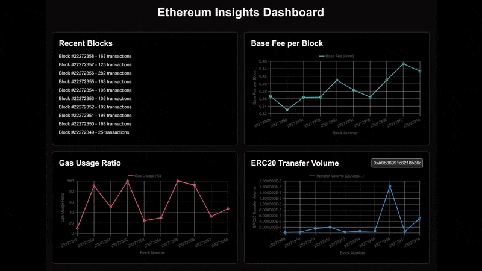

# Real-Time Ethereum Dashboard

An interactive dashboard for visualizing real-time Ethereum network data.

Built with Next.js and TypeScript, this app fetches on-chain Ethereum data and
displays it in a clean, responsive interface using SCSS modules and Recharts.

<div align="center">
  
</div>

## Features

- 🔗 Real-time Ethereum block data
- 📊 Dynamic charts for:
  - Gas Usage
  - Base Fee per Block
  - ERC20 Transfer Volume
- 💡 Clean and responsive dashboard UI
- ⚡ Built with Next.js, TypeScript & SCSS modules

## Tech Stack

- Next.js
- TypeScript
- SCSS Modules
- Ethers.js
- Recharts

## Getting Started

Install dependencies:

```
npm install
```

### Configure Environment Variables

Create a `.env.local` file in the root of the project and add your Alchemy API
key:

```
NEXT_PUBLIC_ALCHEMY_API_KEY=your-alchemy-api-key-here
```

You can get a free API key from: [https://alchemy.com](https://alchemy.com)

### Run the Development Server

```
npm run dev
```

Open [http://localhost:3000](http://localhost:3000) to view the app.

## Project Structure

```
src/
├── app/                  # Main app and page components
│   ├── components/       # Reusable components
│   ├── Dashboard.module.scss # SCSS styles
│   └── page.tsx          # Main page
├── lib/                  # API and utility functions
│   └── alchemy.js        # Alchemy client setup
└── globals.css           # Global styles
```

## Deployment

Deploy with Vercel:

[](https://vercel.com/new)

## License

MIT License
